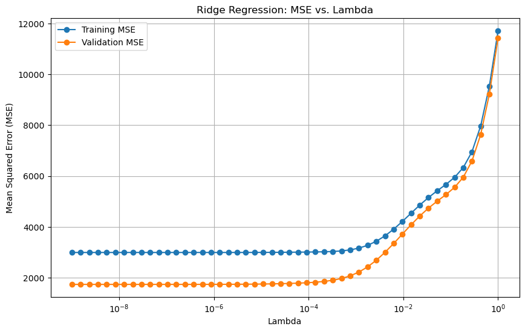

# Ridge Regression Hyperparameter Sweep

Ridge regression hyperparameter sweep (log-spaced $\lambda$) on the scikit-learn Diabetes dataset, with optional quadratic polynomial features (pairwise products + original features), including saved MSE-vs-λ plots and a patient-style prediction example.

## What this project does

- Loads the **Diabetes** regression dataset from `scikit-learn`
- Splits data **by order**: first **90%** train, last **10%** validation
- Trains and evaluates:
  - Linear regression (closed-form) on original features
  - Linear regression (closed-form) on polynomial features (degree-2 cross terms + originals)
  - Ridge regression (closed-form) over a sweep of 50 $\lambda$ values on both feature sets
- Saves two plots:
  - `outputs/figures/ridge_mse_original_features.png`
  - `outputs/figures/ridge_mse_poly_features.png`
- Selects the **best** ridge model by **lowest validation MSE**
- Uses the best polynomial ridge model to predict disease progression for a provided patient profile (Exercise 3.9 style)

## Plots

GitHub Markdown doesn’t reliably support image resizing via ``, so these are embedded with HTML and a fixed width.

### Ridge sweep on original features

<p>
  
</p>

### Ridge sweep on polynomial features

<p>
  
</p>

## Setup

### 1) Create and activate a virtual environment (recommended)

```bash
python -m venv .venv
# macOS/Linux
source .venv/bin/activate
# Windows (PowerShell)
.\.venv\Scripts\Activate.ps1
```

### 2) Install dependencies

```bash
pip install -r requirements.txt
```

## Run

### Reproduce everything (training, sweeps, plots, patient prediction)

```bash
python scripts/run_all.py
```

This will:

- print train/validation MSEs for linear and ridge models
- save the two plot images into `outputs/figures/`
- write a metrics summary JSON to `outputs/metrics/run_summary.json`

### Run only the patient prediction (still re-computes best $\lambda$ via sweep)

```bash
python scripts/predict_patient.py
```

## Outputs

After running `scripts/run_all.py`, you should see:

- `outputs/figures/ridge_mse_original_features.png`
- `outputs/figures/ridge_mse_poly_features.png`
- `outputs/metrics/run_summary.json` (created/overwritten each run)

## Notes on implementation

- **Closed-form solutions**:
  - Linear regression uses a pseudo-inverse for stability.
  - Ridge regression uses `np.linalg.solve` on the normal equations with ridge penalty.
- **Intercept regularization**:
  - By default, the intercept term is **not** regularized (`regularize_intercept=False`), which is the common ridge convention.
- **Polynomial features**:
  - The feature map includes all pairwise products $x_i x_j$ for $i<j$, and then appends the original features.
- **Scaling for the patient example**:
  - The provided patient vector is in the **original feature scale**.
  - The script reproduces the scaling used by `sklearn.datasets.load_diabetes(scaled=True)` with this feature-wise transform:

```math
x_{\mathrm{scaled}} = \frac{x - \mu}{\sigma \sqrt{n}}
```

  - Scaling parameters are computed from `load_diabetes(scaled=False)`.

## Dataset

This project uses the Diabetes dataset shipped with scikit-learn:
- https://scikit-learn.org/stable/datasets/toy_dataset.html#diabetes-dataset

## License

MIT (see `LICENSE`).
